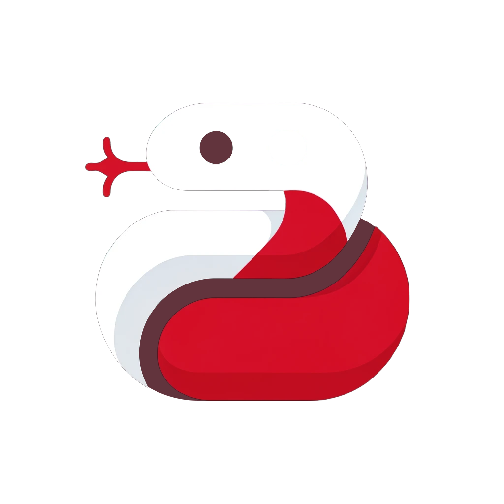

<p  align="center">
  
</p>

# GitHub Actions Workshop
[](https://opensource.org/licenses/Apache-2.0)
[](https://www.python.org/)
[](https://github.com/akatief/actions-workshop/actions/workflows/main.yml)

This is a small workshop teaching how to use [GitHub Actions](https://docs.github.com/en/actions)! You will implement a small action to bump the version of this package and update the logo accordingly. 

## Getting Started

Follow these steps to start working on the workshop:

1. Clone this repository on your device.
2. Create a new repository in your personal GitHub account and push the files there. It's important that the repository is set to public.
3. Prepare a virtual environment:
```bash
python -m venv .venv
source .venv/bin/activate
pip install .
pip install -r requirements-dev.txt
```

Done!

## Task 1 - Bumping versions

### 🔍 Objective 

Software packages are usually identified by a version number. After every update to the package it's important to update this number to distinguish different development stages of the software and make sure you're installing the right version. A problem arises: updating the version number manually is tedious and if you forget to do it you end up with different releases of your software with the same ID.

Your first task is to automatize the update of version number ("bumping"). This repository's version is contained in the `VERSION` file. Create a GitHub Action in the `.github/workflows` folder that bumps the version at every commit that gets pushed on GitHub.

### 🔨 Setting up the Action 

Actions work by creating a small virtual machine on GitHub's server and then execute some commands. This VM is a blank slate and doesn't contain anything, not even the files of your repository. The first step of a GitHub Action therefore is to clone the repo inside the VM.
Worry not! You don't have to write a bash script from scratch, someone has already thought about that and has prepared a plug-and-play [checkout](https://github.com/actions/checkout) action. Simply include it in your GitHub Action `.yml` file.

Just setting up the repository is not enough! You also need to setup Python! Do the same thing with an off the shelf [setup-python action](https://github.com/actions/setup-python).

> SPOILER: You can see this in use in `.github/workflows/main.yml`

### 🔝 Bump Version Action 

Bumping version is a repetitive task, so someone has indeed already automatized it [here](https://github.com/marketplace/actions/bump-versions). This script updates the `VERSION` file and commits to GitHub. You can include it in the same way as Checkout Action.

> NOTE: GitHub Actions cannot push on your repo by default. You have to grant them permissions by going to your repository `Settings > Actions > General` page and setting workflow permissions to read and write. 

## Task 2 - Displaying version in the logo

### 🔍 Objective

We learned how to bump the version, that's great, but there's a problem! The `logo.png` is still stuck at the previous version number. We now want to read the `VERSION` file and write the version at the bottom of `logo_base.png` overwriting the `logo.png` with the old number. Of course, we want to do this automagically through GitHub Actions, but there is no action that can help us this time. We will create our own.

### 🔄 Updating the logo.png file 

Conveniently, the Python package actions workshop contains a script to attach a version number to an image. To call this you can simply use:
```bash
python -m actions_workshop --version VERSION --base-logo logo_base.png --new-logo logo.png
```
This is great, but it's not enough! You also need to include this in your Action as a new step. Remember, you can use a GitHub Action as if it was a bash script. Don't forget to checkout your repository and install Python!

### ✅ Committing changes 

Finally, you need to commit the logo change. Again, this can be done with an off the shelf [action](https://github.com/marketplace/actions/git-auto-commit).